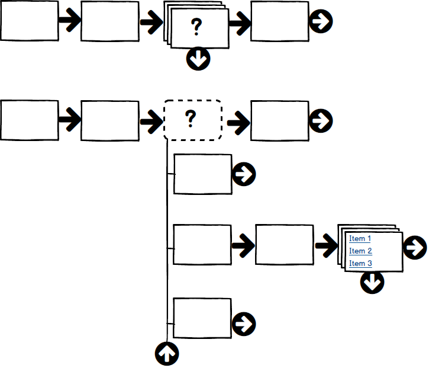

# Flow Editor

Ignore, for the moment, the fact that multiple flow steps may branch to the same sequence. In this case, a flow structure may be visualized as a set of rows, where each row represents a sequence and the first step of the sequence is offset to fall just below the step from which it branches. The following concept mockup illustrates this:

  

In the mockup, individual rectangles represent steps, with regular arrows between those in a sequence. Rectangle _stacks_ represent steps that have branches. The arrows in circles are controls:

* at the ends of a sequence it allows the user to add a new step
* at a branch step, it opens up rows below the step representing the collection of sequences that are targets of the branch (and/or lets the user edit the branch)
* at the end of an open set of branches, the arrow allows the user to close the branches (and/or edit the branch).

Note that the second target sequence itself has a branch that could be opened.

This concept presents a couple of problems:

* How do we deal with the fact that multiple steps may branch to the same sequence?
  * Presumably we can provide a visual indicator that the sequence appears multiple times. In this case, an attempt to edit would trigger a warning that the edit will affect all references with the option to create a copy.
* What happens if we try to open branches from two steps in a single sequence?
  * There are basically two approaches. Either allow only one open branch (so the previous branch auto-closes) or start the sequences for each branch at the row following those from the previous one. My current thinking is to just allow one branch to be open at once.
